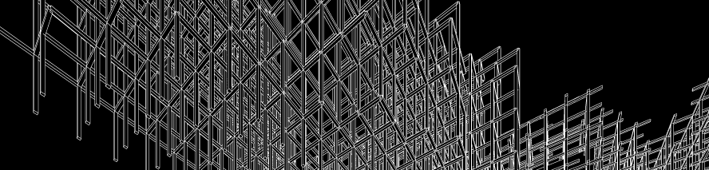

# Spatial Narratives via Web Graphics

### Course Information
XX-XXX (9 Units) 
Carnegie Mellon University School of Architecture 
Class Times: W 6:30PM – 8:20PM 
Class Room: MMCH 303

Instructor: Eddy Man Kim ([eddymankim@cmu.edu](mailto:eddymankim@cmu.edu)) 
Office Hours: By Appointment 
Office Location: MMCH 308

Teaching Assistant: Benjamin Scott ([bescott@andrew.cmu.edu](bescott@andrew.cmu.edu)), Rehan Butt ([rab@andrew.cmu.edu](rab@andrew.cmu.edu)) 
Office Hours & Location: TBA

### Course Description
This course explores experimental applications of web graphics technology in the service of communicating spatial narratives. The spatial narratives will strive to reimagine the concept of space and the practice of storytelling in the context of browser-based graphics environments. This course will contemplate specifically the use of 3-dimensional media via the web as a vehicle for delivering spatial narratives. Web graphics technologies, such as CSS, SVG, Canvas and WebGL, have dramatically increased in their compatibility with both mobile and desktop computing devices and have consequently broadened the reach of graphically rich content to the masses. Students will work on a semester-long project in the form of an interactive web application that challenges, augments, or reaffirms the sense of space through deliberate use of storytelling devices. Upon culmination, the projects will be exhibited on the course website for public viewing. The first half of the course will consist of workshops for building various skills from asset creation to graphics programming. Starting with a brief introduction to HTML/CSS/JS and the Jekyll site generator, the workshops will focus primarily on the THREE.js library. The second half of the course will focus on the production of the final project where class times will turn into hack sessions. While there is no prerequisite for this course, some familiarity of the technologies mentioned above and basic programming skills are highly preferred. First class will meet after Labor Day on September 6, 2017.

### Learning Objectives

### Outcomes
By the end of the course, students should have the following outcomes:

### Weekly Logistics

- Week 1: No Class
- Week 2: Course Introduction
- Week 3: Overview of Web Graphics
- Week 4: Getting Started with THREE.js
- Week 5: 3D Modeling, UV mapping
- Week 6: Text, Audio, Video Inclusion
- Week 7: Post-processing Effects; Narrative Devices & Atmospheric Aesthetics
- Week 8: Animation, Shaders, Events
- Week 9: Getting Final Projects Started
- Week 10: Project Progress Review, Hack Session
- Week 11: Project Progress Review, Hack Session
- Week 12: Project Progress Review, Hack Session
- Week 13: Project Progress Review, Hack Session
- Week 14: Project Progress Review, Hack Session
- Week 15: Project Progress Review, Hack Session